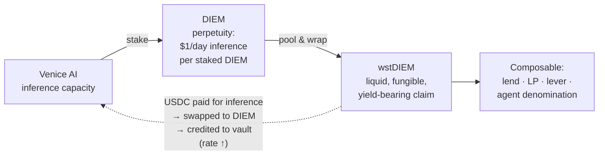
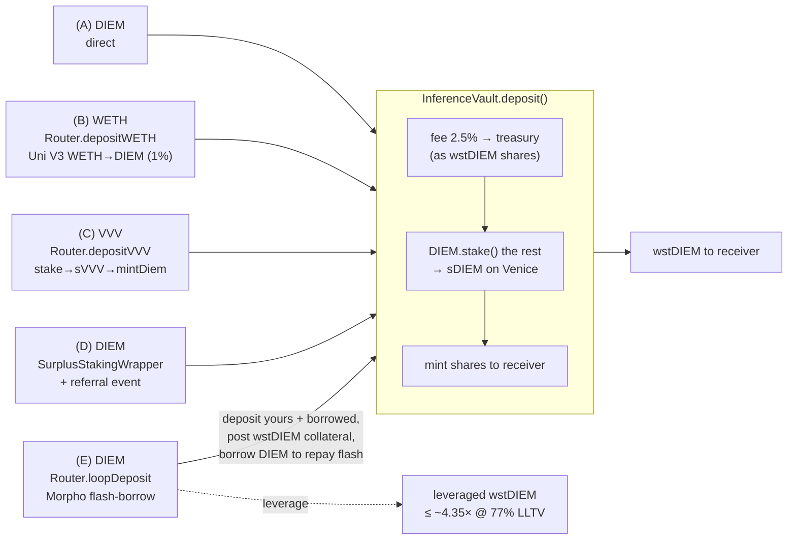
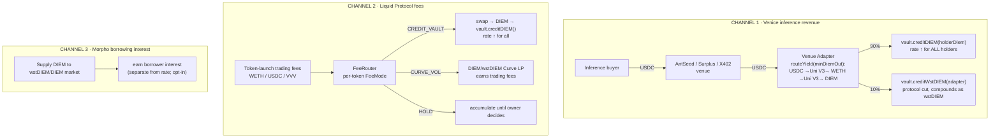
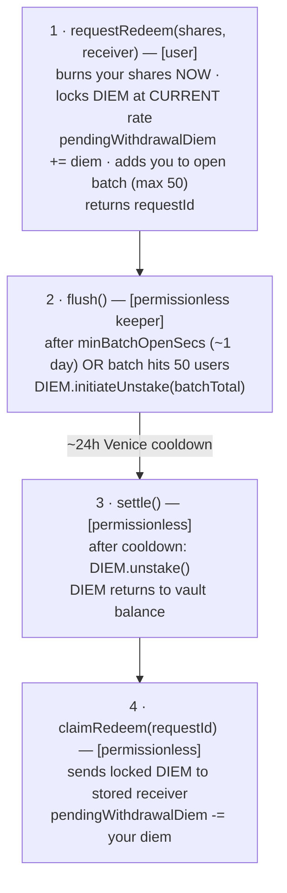
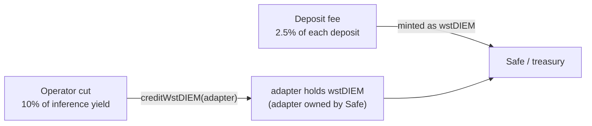

# wstDIEM & Tokenized Inference — Technical Overview

**Audience:** new engineers joining wstDIEM / the inference-tokenization product.
**Status:** v6 LIVE on Base mainnet (deployed 2026-06-10). Lending markets created but **unseeded**.
**Last updated:** 2026-06-26.

This is the orientation doc. It explains *what the product is*, *how money moves through it*, and *what is actually live today*. It deliberately does not repeat material that lives elsewhere — when you need exact addresses, ops steps, or fee tables, follow the links:

| You want… | Read |
|-----------|------|
| Exact deployed addresses (canonical, drifts) | [`mainnet-addresses.md`](./mainnet-addresses.md) |
| Architecture diagram + invariants | [`SYSTEM_OVERVIEW.md`](./SYSTEM_OVERVIEW.md) |
| Fee tables, rate/yield math | [`wstdiem-economics.md`](./wstdiem-economics.md) |
| User deposit/exit paths + code snippets | [`DEPOSIT_GUIDE.md`](./DEPOSIT_GUIDE.md) |
| Keeper / routine ops | [`KEEPER_RUNBOOK.md`](./KEEPER_RUNBOOK.md) |
| Security findings | [`SECURITY_REVIEW.md`](./SECURITY_REVIEW.md) |
| Launch framing + disclaimers | [`V6_LAUNCH.md`](./V6_LAUNCH.md) |

Source lives in `src/vault/`. Solidity 0.8.28, viaIR, 20k optimizer runs, Cancun. Everything is on **Base mainnet (chain 8453)**.

---

## 1. The thesis: tokenizing inference

Start with the asset, because everything else is downstream of it.

**DIEM** is Venice AI's staking token. Staking 1 DIEM grants the holder **$1/day of Venice inference, in perpetuity**. That makes DIEM a perpetuity, not a stablecoin — it prices around **$1,100–1,450 on-chain** (≈ 89 VVV per DIEM). Staked DIEM lives inside Venice's contract as **sDIEM** and produces an *inference entitlement* rather than a cash yield.

The problem: raw staked DIEM is illiquid and clunky. You can't easily trade it, use it as collateral, or let many parties share one staking position. And the "yield" is API capacity, not a number that compounds.

**wstDIEM solves this.** It is an ERC-4626 vault that:

1. **Pools DIEM and stakes it** on Venice, so the vault holds one big sDIEM position and grants its depositors a *liquid, fungible claim* (the wstDIEM ERC-20).
2. **Converts inference cashflow back into DIEM.** When someone pays (in USDC) to use the vault's inference capacity, that USDC is swapped to DIEM and credited to the vault — raising what every wstDIEM share is worth. Inference revenue becomes token appreciation.
3. **Makes the position composable** — wstDIEM can be lent against, LP'd, leveraged, and used as the denomination for autonomous-agent economics.

The mental model is **wstETH for AI inference**. You hold a fixed share count; each share redeems for a growing amount of DIEM as inference revenue accrues. No claiming, no rebasing of balances — just a rising exchange rate.



"Tokenizing inference" = turning Venice's $1/day/DIEM entitlement into a liquid token whose value tracks real inference revenue.

---

## 2. The exchange-rate engine (read this before anything else)

Everything in the system exists to push one number up: the wstDIEM→DIEM exchange rate.

```
rate = totalAssets() / totalSupply()
totalAssets() = idle DIEM + amountStaked + coolDownAmount − pendingWithdrawalDiem
```

- **`amountStaked`** — DIEM actively staked in Venice (the bulk of it). `DIEM.stake()` moves DIEM *out of* `balanceOf` into Venice's internal `stakedInfos`, so you can't read it as a normal balance — `totalAssets()` reconstructs it from `stakedInfos(vault)`.
- **`coolDownAmount`** — DIEM mid-unstake (the ~24h Venice cooldown window).
- **`pendingWithdrawalDiem`** — DIEM already earmarked for in-flight redemptions. **Subtracted** so the rate stays flat across the whole withdrawal lifecycle (this is the oracle-safety invariant — see §6).

`stakedInfos(addr)` returns `(amountStaked, coolDownEnd, coolDownAmount)` — **field 1 is a timestamp, not an amount**. This trips everyone up once.

Two functions move the rate, both gated to **registered venue adapters only** (`isVenueAdapter[msg.sender]`):

| Function | Effect | Who it benefits |
|----------|--------|-----------------|
| `creditDIEM(amount)` | Pulls DIEM in, stakes it, **mints no shares**. `totalAssets` rises, `totalSupply` doesn't → rate rises for **everyone**. | All holders, pro-rata |
| `creditWstDIEM(amount, recipient)` | Pulls + stakes DIEM, mints shares **to a recipient at the current rate** (no deposit fee). Share count computed *before* the transfer to prevent rate manipulation. | The named recipient (used for the protocol's operator cut) |

The rate is a **one-way ratchet**: `creditDIEM` only ever adds assets. Barring a Venice slashing event, it cannot go down. (A small optional `yieldFeeBps`, default 5%, is skimmed to treasury as shares on credit — it doesn't reduce the rate, it just dilutes slightly. See economics doc.)

---

## 3. The contract map

Two independent subsystems share this repo. **This doc is only about subsystem 2.** (Subsystem 1, "Liquid Protocol," is the Clanker-forked token launchpad in `src/` — see the top-level `README.md`. Its only tie-in here is that its trading fees feed the vault via the FeeRouter.)

### Core vault

| Contract | Role |
|----------|------|
| **`InferenceVault`** | The ERC-4626 vault and the wstDIEM token itself. Deposit DIEM → `DIEM.stake()` → mint wstDIEM. Holds the async redeem queue. Implements **ERC-1271** so it can hold the Venice API key (§5). Owner = Safe. |
| **`Router`** | Multi-asset front door. `depositWETH` (WETH→DIEM via Uni V3), `depositVVV` (VVV→sVVV→mintDiem), `exitToWETH` (wstDIEM→WETH via Uni V4), and the Morpho **leverage loop** (`loopDeposit`/`unloopDeposit`). |
| **`FeeRouter`** | Aggregates protocol fee income (WETH/USDC/VVV/wstDIEM) and routes each token per a configurable `FeeMode`. The bridge from Liquid Protocol fees → vault yield. |
| **`SurplusStakingWrapper`** | Thin deposit wrapper that adds on-chain referral tracking and a synchronous Curve exit. |

### Inference revenue plumbing

| Contract | Role |
|----------|------|
| **`adapters/` (`AntSeedAdapter`, `SurplusAdapter`, `X402Adapter`)** | One per inference venue. Receive settlement USDC, then `routeYield()` swaps USDC→WETH→DIEM and credits the vault (90% to all holders, 10% to the protocol as wstDIEM). All extend `BaseInferenceAdapter`. |
| **`InferenceProduct`** | On-chain registry + USDC settlement for *selling* the vault's inference capacity. Tracks total/allocated DIEM capacity, sells time-bounded slices, routes payment to the FeeRouter. |
| **`AgentTGERegistry`** | Agent lifecycle: Bronze/Silver/Gold tiers, 30-day dormancy tracking. The hook for autonomous-agent denomination. |

### Liquidity & oracles

| Contract | Role |
|----------|------|
| **`oracles/WstDiemVvvOracle`** | **Canonical** Morpho oracle. Fully on-chain: `convertToAssets(1e18) × Aerodrome DIEM/VVV TWAP`. No USD feed. Immutable. |
| **`oracles/WstDiem{Usdc,Weth}Oracle`** | **DEPRECATED** — hardcode `DIEM = $1`. Markets unseeded, do not use (MOG-542/549). |
| **`WstDIEMHook`** | Uniswap V4 dynamic-fee hook for the wstDIEM/WETH pool. Today it always returns a flat 5 bps; NAV-aware fee selection is deferred to WP-5. |
| **`LiquidityManager`** | Safe-owned holder of the V4 wstDIEM/WETH LP position. Pool key + tick range are constructor immutables (one deploy = one pool). |

> ⚠️ **Doc-vs-code note:** CLAUDE.md describes `InferenceProduct` as managing "ephemeral wallet slots" with VVV/Direct creation paths. The *current source* is simpler — a capacity-and-purchase ledger (`setCapacity` / `buy` / `releaseExpired`). Capacity is grown off-chain (keeper stakes DIEM, mirrors it via `setCapacity`); the contract just sells and settles it. Trust the code.

---

## 4. Funds flow

This is the core of the doc. There are four distinct flows. In all of them, **DIEM that enters the vault gets staked and never leaves except through the redeem queue.**

### 4.1 Deposit flow (money in → wstDIEM out)

Five entry paths, all landing in the same place — `InferenceVault.deposit()`, which charges a **2.5% deposit fee** (minted to treasury as shares, *not* skimmed from your DIEM) and immediately stakes the rest.



- **(A) Direct DIEM** is cheapest (just the 2.5% fee). **(B) WETH** and **(C) VVV** add an external AMM hop. **(D)** is (A) plus a referral event. **(E)** is the leverage loop — one transaction that flash-borrows DIEM against Morpho, deposits the combined amount, and posts the resulting wstDIEM as collateral.
- sVVV is **non-transferable**, which is why the VVV path must stake *inside* the Router — the Router can't pull sVVV from a user.
- Slippage on the swap legs (B/C) is *not* individually bounded; the Router enforces a single `minWstDIEM` floor on the final share output. See `DEPOSIT_GUIDE.md` for snippets.

### 4.2 Yield / revenue flow (inference & fees → rate ↑)

This is the engine. Three independent revenue channels all converge on `creditDIEM()`, raising the rate for every holder.



Key points:

- **`creditDIEM`/`creditWstDIEM` are adapter-only.** That's the whole reason adapters must be registered via `vault.setVenueAdapter(...)`. An unregistered adapter's `routeYield` reverts at the credit step.
- The **90/10 split** is the protocol's revenue model: 90% of net inference yield raises the rate for everyone; 10% accrues to the Safe-owned adapter *as wstDIEM*, so the protocol compounds alongside users instead of extracting cash. The operator cut is Safe-configurable up to a 20% cap (`operatorFeeBps`, default 1000).
- **`routeYield` takes a caller-supplied `minDiemOut`.** This is the MOG-541 fix: before, the swap used `amountOutMinimum = 0` and was sandwichable. The keeper now derives `minDiemOut` from a fresh quote (default 2% slippage). This is the one High-severity finding from the security review, and it is fixed and live.
- **`InferenceProduct` is the sell side** of Channel 1: a buyer calls `buy(diemAmount, numDays, maxPrice)`, pays USDC at `pricePerDiemDayUSDC` (0.8e6 = $0.80/DIEM/day), and that USDC is forwarded to the FeeRouter. The keeper maps the purchase to actual API access off-chain.

### 4.3 Withdrawal flow (wstDIEM → DIEM, async)

Withdrawals are **asynchronous** because Venice imposes a ~24h unstake cooldown, and Venice allows only one pending unstake per address. Instant `withdraw`/`redeem` are disabled (they return 0). The queue batches users to amortize that single cooldown slot.



- **Total time ≈ 2 days** (≤1-day batch window + ~24h cooldown). The old "14 days" figure was the v4 vault — ignore it.
- **Your rate is locked at `requestRedeem` time.** Later rate changes don't affect your payout, and your DIEM is excluded from `totalAssets` for the whole window so the rate doesn't blip.
- `settle()` and `claimRedeem()` are **not pausable** — once a withdrawal is initiated, it can always complete even if the vault is paused.

**Faster synchronous exits** exist if you accept market pricing instead of NAV:

| Exit | Path | Speed |
|------|------|-------|
| Async redeem (canonical, full NAV) | queue above | ~2 days |
| Curve | `exchange(1,0,…)` wstDIEM→DIEM | instant, ~peg |
| V4 / WETH | `Router.exitToWETH` (V4 0.3% pool) | instant |
| Wrapper | `SurplusStakingWrapper.unstakeForUser` → Curve | instant |

### 4.4 Fee flow (where the protocol's cut goes)

The protocol takes exactly two cuts, both compounding rather than extractive, both landing at the **Safe / treasury**:



There is **no withdrawal fee, no performance fee, no management fee.** The optional `yieldFeeBps` (≤20%, default 5%) skims a few shares to treasury when adapters credit yield. External AMM fees (Uniswap, Curve) are paid to those venues, not the protocol — see the swap-cost table in `wstdiem-economics.md`.

---

## 5. The Venice ERC-1271 link (how the vault actually buys inference)

The vault doesn't "call an inference API." Instead, Venice binds an API key to a wallet by having that wallet sign a challenge. The vault is a contract, so it implements **ERC-1271 `isValidSignature(hash, sig)`**: it returns the magic value iff the recovered signer equals `veniceSigner` — a **hot key kept separate from the Safe owner**, rotatable via `setVeniceSigner`.

That lets the vault hold a Venice API key whose inference budget *is* `stakedInfos(vault).amountStaked`. As TVL grows, the vault's staked DIEM grows, and the API key's capacity grows with it. `InferenceProduct` and the agent registry are the layers that sub-allocate and sell that capacity.

> **Today:** `veniceSigner` is still the v5 deployer key. It must be rotated to a Privy server wallet before production key registration. (Tracked in the launch TODO.)

---

## 6. Why the rate stays flat during withdrawals (the oracle invariant)

The Morpho lending markets read the wstDIEM price from `vault.convertToAssets(1e18)`. If the rate twitched every time someone requested or claimed a redemption, those reads would be exploitable. The fix: `pendingWithdrawalDiem` is added to the books the instant `requestRedeem` burns shares, and subtracted from `totalAssets()` for the entire flush→settle→claim window. Net effect: **`convertToAssets()` is constant across the whole withdrawal lifecycle.** Keep this invariant intact if you touch the queue.

---

## 7. How it works today (live state, 2026-06-26)

**Live and working:**

- **v6 core stack is deployed and Basescan-verified** (vault, Router, FeeRouter, hook, oracles, Curve pool, LiquidityManager, registry, wrapper, InferenceProduct). Owned by the Safe from birth; deployer key was single-use and holds nothing. Inflation-attack guarded (genesis seed burned to `address(1)`). Addresses in [`mainnet-addresses.md`](./mainnet-addresses.md) — **always read addresses from there, they drift between versions.**
- **Deposits work** on all paths. The 2.5% fee and immediate staking are confirmed by the smoke-test plan.
- **Inference yield relay is live:** AntSeed + Surplus adapters are registered (`isVenueAdapter = true`) with the MOG-541 `routeYield(minDiemOut)` fix. Keeper `0x988CE72d…` is operator + authorized settler on both; `keeper-compound.sh` automates the USDC→DIEM→creditDIEM compounding. **X402Adapter is NOT redeployed for v6** — only AntSeed + Surplus are live.

**Built but gated / not yet seeded:**

- **Lending markets are UNSEEDED.** The wstDIEM/VVV (62.5% LLTV, canonical) and wstDIEM/DIEM (86% LLTV, leverage loop) markets exist but have no liquidity, so **borrowing and the leverage loop are not live yet.** Seeding is gated on liquidation-path depth (MOG-536) and DIEM sourcing (MOG-547); borrow caps will be sized to the ~$6M Aerodrome DIEM/VVV pool.
- **The two USD-denominated oracles/markets (wstDIEM/USDC, wstDIEM/WETH) are DEPRECATED** — they hardcode DIEM=$1 (it trades ~$1,100–1,450). Do not seed or use them. `WstDiemVvvOracle` is the canonical pricing path.
- **`WstDIEMHook` fee selection is a stub** — flat 5 bps today; NAV/TWAP-aware fees deferred to WP-5.
- **`veniceSigner` not yet rotated** to a production Privy wallet.

**The "$1" gotcha (MOG-549) — internalize this:** "$1" appears in two roles. As an **inference entitlement** ($1/DIEM/day in `AgentTGERegistry` tiers and `InferenceProduct` capacity) it is **correct** — it's Venice's real mechanic. As a **collateral price** (the two deprecated oracles + the old V4 init) it is **wrong**. The FeeRouter, adapters, and Router all convert at *market* price (`amountOutMinimum:0` / caller-supplied floors), so they carry no $1 assumption.

**Security posture:** internal multi-agent review (MOG-532) found 1 High + 2 Medium, no principal-loss issues. High is fixed and live; Mediums addressed (oracles deprecated, `recordFeeReceipt` gated). **A third-party audit is still pending and recommended before large external TVL.** See [`SECURITY_REVIEW.md`](./SECURITY_REVIEW.md).

---

## 8. The agent flywheel (where this is heading)

wstDIEM is designed to be the **denomination token for autonomous AI agents**:

1. An agent holds wstDIEM → it owns a slice of the vault's Venice inference capacity (proportional to `stakedInfos(vault).amountStaked / totalSupply`).
2. The agent serves inference and earns USDC.
3. That USDC routes back through a venue adapter → `creditDIEM()` → the rate rises.
4. The agent's *own* wstDIEM is now worth more DIEM = more inference capacity → it can serve more.

Each agent becomes a **self-compounding node**: revenue it generates makes its own holdings more productive. `AgentTGERegistry` (tiers, dormancy) and `InferenceProduct` (capacity sales) are the on-chain scaffolding for this. The target is to denominate agent tiers in wstDIEM via `convertToAssets`, so thresholds auto-adjust as the rate grows. This is the Phase-4 roadmap item in [`GROWTH_PLAN.md`](./GROWTH_PLAN.md) — scaffolding is deployed, full agent integration is still ahead.

---

## 9. Gotchas worth memorizing

These are non-obvious and have caused real bugs (also in CLAUDE.md):

- **`DIEM.stake()` empties `balanceOf`.** After staking, `DIEM.balanceOf(vault) == 0`; read the stake from `stakedInfos`. It needs no prior `approve` (stakes from `msg.sender`'s own balance).
- **`stakedInfos` field 1 is a timestamp** (`coolDownEnd`), not an amount.
- **`IVVVStaking.mintDiem(uint256,uint256)` returns void** — measure the DIEM you got with a `balanceOf` delta.
- **sVVV is non-transferable** (`transferFrom` reverts `NOT_TRANSFERRABLE`). Only the `depositVVV` path works, because it stakes inside the Router.
- **Two different VVV tokens:** liquid VVV (`0xacfE60…`, the ERC-20 / Morpho loan token / Aerodrome pair) vs. non-transferable sVVV (`0x321b7f…`, the staking receipt). Use liquid VVV anywhere you need a transferable token.
- **`creditDIEM`/`creditWstDIEM` revert for non-adapters.** Register via `setVenueAdapter` first.
- **Uniswap V3 SwapRouter02 on Base is `0x2626…`**, not the Ethereum `0x68b3…`.
- **Use Foundry v1.5.1** before committing — `forge fmt` output differs between releases and will break CI.

---

*Questions this doc doesn't answer? The linked docs in the table up top are more current than CLAUDE.md for anything vault-specific. For ops, `KEEPER_RUNBOOK.md` is authoritative.*
